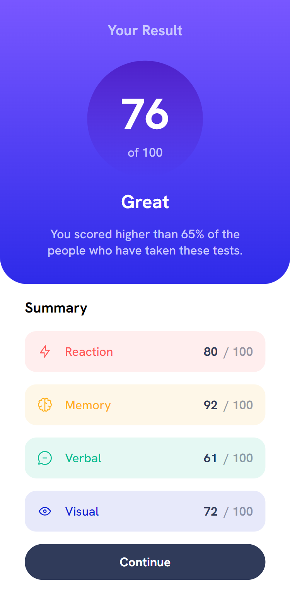
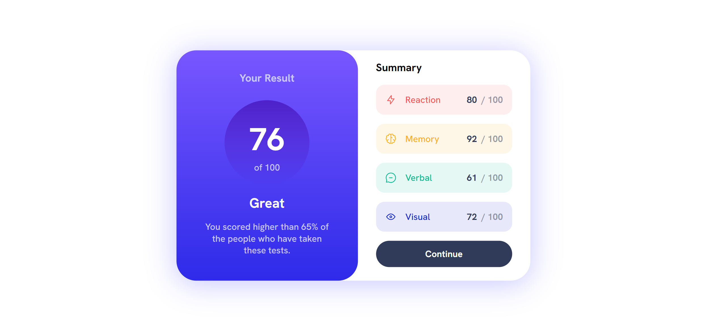
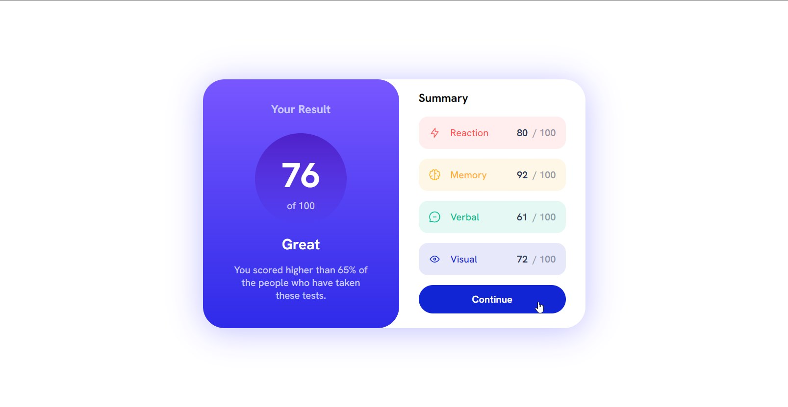

# Frontend Mentor - Results summary component solution

This is a solution to the [Results summary component challenge on Frontend Mentor](https://www.frontendmentor.io/challenges/results-summary-component-CE_K6s0maV). Frontend Mentor challenges help you improve your coding skills by building realistic projects. 

## Table of contents

- [Overview](#overview)
  - [The challenge](#the-challenge)
  - [Screenshot](#screenshot)
  - [Links](#links)
- [My process](#my-process)
  - [Built with](#built-with)
  - [Continued development](#continued-development)
- [Author](#author)

## Overview

### The challenge

Users should be able to:

- View the optimal layout for the interface depending on their device's screen size
- See hover and focus states for all interactive elements on the page

### Screenshot

### Links

- Solution URL: [Frontend Mentor](https://www.frontendmentor.io/solutions/responsive-results-summary-component-using-flex-grid-and-react-js-_xF1ylCQVq)
- Live Site URL: [Github Pages](https://amrmabdelazeem.github.io/results-summary-component/)

## My process

- Build React environment
- Build Components
- Import Data from JSON file
- Seperated each skill look with props
- Finished mobile first view
- Build desktop view with responsive media queries.

### Built with

- Semantic HTML5 markup
- CSS custom properties
- Flexbox
- CSS Grid
- Mobile-first workflow
- [React](https://reactjs.org/) - JS library
- [Google Fonts](https://fonts.google.com/specimen/Hanken+Grotesk) - For fonts

### Continued development

I'm getting familier with React JS more and more, but I'd like to shift some focus on my MERN skills with the backend.

## Author

- Website - [Github](https://github.com/amrmabdelazeem)
- Frontend Mentor - [@amrmabdelazeem](https://www.frontendmentor.io/profile/amrmabdelazeem)